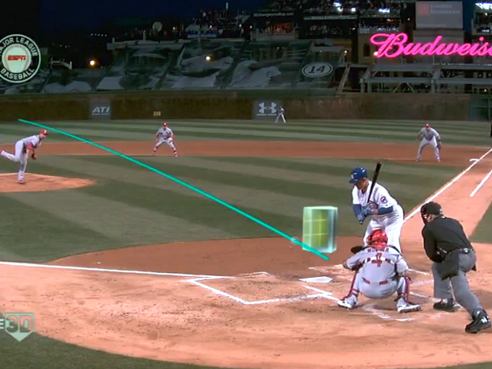
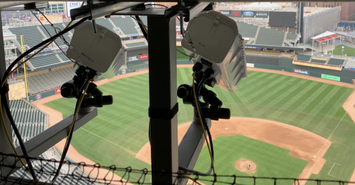
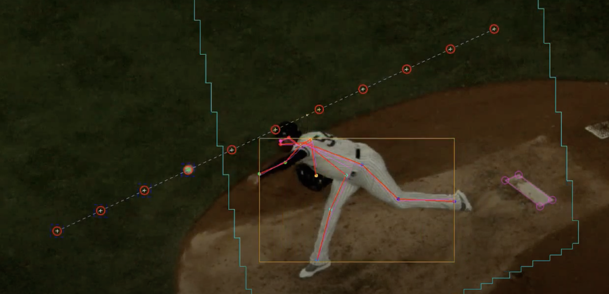
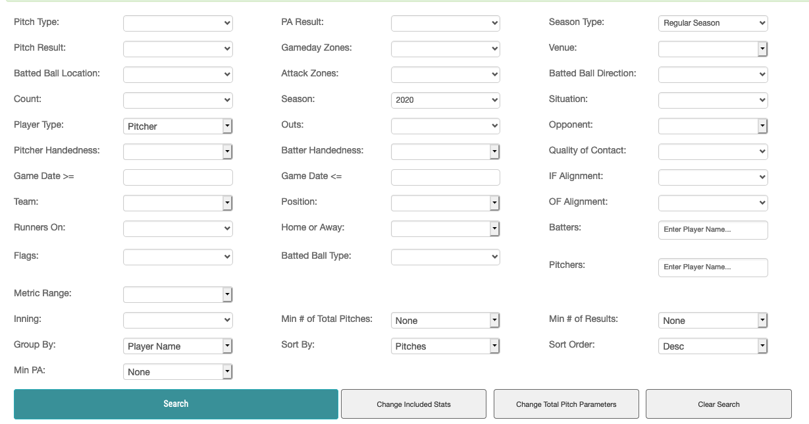
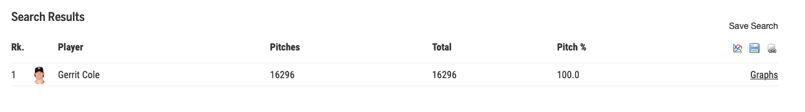

Statcast Pitch Tracking
======================

Statcast is a tracking technology that allows for the collection and analysis of a massive amount of baseball data based on ball flight paths and player movements. The initial radar+camera system was installed in all 30 parks in 2015 after a partial trial run in 2014.

  

## Contents
1. [Dataset](#dataset)
2. [Exploratory data analysis](#eda)
2. [Future Directions](#future-directions)

___

### Hawk-Eye

  

In 2020, MLB switched from Trackman to Hawk-Eye Innovations tracking technology. Hawk-Eye systems are based on the principles of triangulation using visual images and timing data provided by a number of high-speed video cameras located at different locations and angles around the area of play. In each frame sent from each camera, the system identifies the group of pixels which corresponds to the image of the ball and calculates the position of the ball by comparing its position on at least two cameras at the same instant in time. A succession of frames builds a record of the ball travel path and predicts the future flight path of the ball, as well as where it will interact with the playing area features programmed into the database. The system can even interpret these interactions to decide infringements of the rules of the game.

  

Hawk-Eye first partnered with MLB through the 2014 launch of the video replay system. The Hawk-Eye Statcast system uses a total of 12 cameras for optical pitch, hit and player tracking. Five cameras operating at 100 frames per second are primarily dedicated to pitch tracking, while an additional seven cameras are focused on tracking players and batted balls at 50 frames per second. Objects are tracked to within 0.5cm accuracy of their true positions.

   

___

### Google Cloud

Also in 2020, MLB migrated its Wheelhouse Data and Analytics Platform to BigQuery, Google Cloud’s enterprise data warehouse. In a Google Cloud demo, five years of Statcast pitch data are mapped via a K-Means clustering algorithm and PCA dimensionality reduction onto a 3D space. The clusters represent pitchers' strategies, demonstrating one possible use of machine learning with this dataset.

___

### Baseball Savant

BaseballSavant.MLB.com is MLB.com's clearinghouse for Statcast data. It reports measurements (raw numbers from the on-field action) and metrics (combinations of raw measurements into useful numbers) and provides a real-time game feed with tracking data. Baseball Savant includes a powerful search tool to create custom queries and download the output as .csv files. However, for hypothesis testing and modeling purposes, it is useful to have an observation for each pitch; the website does not offer this functionality.

  

A query for all pitches thrown by Gerrit Cole in the Statcast era, for example, returns a total count.

 

At this point, I registered for an account at sportradar.com to use their Statcast API called MLB v7. I used this command in terminal.
`curl -X GET "http://api.sportradar.us/mlb/trial/v7/en/players/46734ad0-e55b-4e2f-8a0d-72387470fcdf/pitch_metrics.json?api_key=bhj2xb7z*****"`
The ouput was:
`<h1>Developer Inactive</h1>%`
:unamused:

I returned to Baseball Savant to try web scraping. Studying the URL form the search tool, I found two parameters I needed to add to the beginning and end of the URL in order to output a .csv with details for each pitch. The URL now looked like this.

`https://baseballsavant.mlb.com/statcast_search/csv?all=true?hfPT=&...c&min_pas=0&type=detail&`

The other parameters could be filled in with team or season to break the datast up into manageable sizes. I estimate all Statcast pitch data since 2015 would be a 1.6 GB file.

