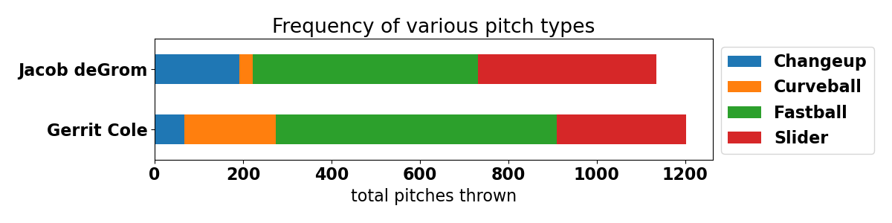

Ace versus Ace: An analysis of 2020 Statcast data for Gerrit Cole and Jacob deGrom
======================

Statcast is a tracking technology that allows for the collection and analysis of a massive amount of baseball data based on ball flight paths and player movements. The initial camera and radar system was installed in all 30 MLB parks in 2015 after a trial run in 2014. This project focuses specifically on Statcast data for two pitchers, Gerrit Cole of the New York Yankees and Jacob deGrom of the New York Mets, gathered during the abbreviated 2020 season. The dataset includes a total of 2,338 pitches, each with five features: pitch type, release speed, release spin rate, vertical movement, and horizontal movement.

  

___

## Overview

Baseball players, managers, scouts, and fans alike have used stats to analyze and compare player performance for as long as baseball has been played. As the game increased in competitiveness and complexity, more statistics were tracked, and in some cases, as with RBIs and saves, retroactively added to playing careers long since ended. Until relatively recently in the sport's history, metrics were limited to counting stats such as strikeouts and wins or averages such as ERA and WHIP. With the introduction of the radar gun as a measure of pitch speed in the late 1970s, baseball turned a corner. Scouts had a new way to judge a player's ability based on raw, on-field athletic performance. in 2015, the amount of on-field measurements exploded with the introduction of Statcast.

Much of the value of Statcast data has been realized already. Pitchers such as Adam Ottavino have revived their careers through a process known as pitch design. Using real-time feedback from high-speed cameras connected to a laptop computing movement, the pitcher tweaks mechanics and grips until he achieves a maximally breaking pitch. On the visualization front, Daren Willman, founder of the Baseball Savant website, has produced some truly excellent and original diagrams providing new insights into an old game. For the purposes of this project, I wanted to see what measurable on-field factors were associated with a successful pitch and outing and their opposites. It stands to reason that a pitcher may achieve an edge id he knows what factors are correlated with his successes and failures. On the opposite side of the ball, a hitter who knows the pitcher's usual plan of attack is more prepared for the location, movement, and sequence of pitches.
___

## Hawk-Eye

  

In 2020, MLB switched from Trackman to Hawk-Eye Innovations tracking technology. Hawk-Eye systems are based on the principles of triangulation using visual images and timing data provided by a series of high-speed video cameras located at different locations and angles around the field. In each frame, the system identifies the group of pixels which corresponds to the image of the ball and calculates its true 3d position by comparing its 2d position on at least two cameras at the same instant in time. A succession of frames builds a record of the ball travel path and predicts the future flight path of the ball, as well as where it will interact with the playing area features programmed into the database. The system can even interpret these interactions to decide infringements of the rules of the game.

  

Hawk-Eye first partnered with MLB through the 2014 launch of the video replay system. The Hawk-Eye Statcast system uses a total of 12 cameras for optical pitch, hit and player tracking. Five cameras operating at 100 frames per second are primarily dedicated to pitch tracking, while an additional seven cameras are focused on tracking players and batted balls at 50 frames per second. Objects are tracked to within 0.5cm accuracy of their true positions.

   

___

## Baseball Savant

BaseballSavant.MLB.com is MLB.com's clearinghouse for Statcast data. It reports measurements (raw numbers from the on-field action) and metrics (combinations of raw measurements into useful numbers) and provides a real-time game feed with tracking data. Baseball Savant includes a search tool to create custom queries and download the output as .csv files. However, for hypothesis testing and modeling purposes, it is useful to have an observation for each pitch and the website does not offer this functionality. A query for all pitches thrown by Gerrit Cole in the Statcast era, for example, returns only a total count and summary statistics. Fortunately, the site allows web scraping with a simple change to the URL on the search tool page. Adding `csv?all=true` to the beginning and `type=detail` to the end will automatically download a .csv file with individual observations. These files must be broken up by for general datasets by changing the `team` and `Sea` parameters. Looping through the database in this way, I was able to download all pitching Statcast data (2015-2020, 1.7GB) into a database file in about 30 minutes with a high-speed internet connection (~80 Mbps.) I learned of this method through the work of Alan Kessler, chief data scientist of the St. Louis Cardinals.

	  for season in seasons:
		for team in teams:
		    for place in where:
			pd.io.sql.to_sql(savant_call(season, team, place),
					 name='statcast', con=savant, if_exists='append')

Once the database files were created, I used an SQLite query to select intresting columns. Depracated stats showed up as empty columns and those I simply skipped over. As for wrangling, I used `sklearn.OneHotEncoder` to create dummy variables for pitch types. I also merged the `events` and `description` columns into a single outcome for every pitch, which I planned to use as a gauge of pitch successfulness. Lastly, I added a `strikeout_looking` event to distinguish it from `strikeout_swinging`.

(As a possible alternative, an API for this data is available at sportradar.com. However, I did not have success using my trial key and did not pursue the matter further given the ease of scraping the data.)

  

___

## Visualizations

**Stacked bar chart of pitch frequencies in 2020**

 

___

**Boxplots of speed, spin rates, and movement lateral and vertical**

Release speeds             |  Release spin rates
:-------------------------:|:-------------------------:
   |  

Lateral movements          |  Vertical movements
:-------------------------:|:-------------------------:
   |   

___

**Density plots comparing speeds grouped by pitch type**

Unit is MPH measured out-of-hand.

 

___

**Density plots comparing spin rates grouped by pitch type**

Unit is RPM. A baseball spins approximately 17 to 22 times during travel.

 

___

**Density plots comparing lateral movement grouped by pitch type**

Lateral movement from catcher's perspective. Unit is inches moved in last 40 ft. Negative values move in on a right-handed hitter and vice versa.

 

___

**Density plots comparing vertical movement grouped by pitch type**

Vertical movement from catcher's perspective. Unit is inches moved in last 40 ft. Negative values move down and vice versa. While no pitch technically rises (due to gravity), rise in this case means the deviation from the path of a ball with no spin-induced movement.

 
 

___

## Hypotheses and method

In this section, I describe the results of 16 hypotheses tests perfored with the `ttests.py` script. The tests examine four pitches thrown by each pitcher (fastballs, sliders, changeups, and curveballs) and four measurments for each of those pitches (release speed, release spin rate, late horizontal movement, and late vertical movement,) In all cases, I use a Welch's t-test; some of the sample sizes are uneven. Thos is due to the fact that Cole favors curveballs and deGrom favors changeups. In order to perform a Welch's t-test, I use `scipy.stats.ttest_ind`.

`result = scs.ttest_ind(df_cole[df_cole.pitch_type==pitch][stat], df_degrom[df_degrom.pitch_type==pitch][stat], equal_var=False)`

### Hypothesis the first: FF + release_speed

**Scientific Question**
    
   Are the the mean fastball release speeds between Jacob deGrom and Gerrit Cole the same?

**Null Hypothesis**
    
   The mean fastball release speeds between deGrom and Cole are the same.

**Alternative Hypothesis**
    
   The mean fastball release speeds between deGrom and Cole are not the same.
    
**Distribution under the null hypothesis**
    
   The distribution of the null hypothesis represents the difference between the mean of the two distributions. Comparing the release speeds for fastballs, it is
   the distribution of the difference of samples means where the assumption is that the mean of this distribution is zero:
   𝜇FF_speed deGrom - 𝜇FF_speed Cole = 0

**Significance level**
    
   I will select a standard significance level of 0.05. I will also use a Bonferonni correction of 4 to account for the fact that I will be comparing multiple means of fastball measurements between the pitchers. Therefore, my signficance for each individual test will be 𝛼=0.05/4 = 0.0125.

**p-value**

    Gerrit Cole mean release speed: 96.7
    Jacob deGrom mean release speed: 98.6
    Gerrit Cole sample size: 635
    Jacob deGrom sample size: 510
    t-stat: -28.6
    p-value: 4e-136

 

**Conclusion**

   We have a p-value and need to compare it to our significance level of 0.0125. The p-value (the probability of seeing this result or a result more extreme given the null hypothesis) is far less than the significance level. Therefore, my conclusion is:
   
   I **reject the null** hypothesis that the release speed means are the same.
   
___

### Hypothesis the second: SL + release_spin_rate

**Scientific Question**
    
   Are the the mean slider release spin rates between Jacob deGrom and Gerrit Cole the same?

**Null Hypothesis**
    
   The mean slider release spin rates between deGrom and Cole are the same.

**Alternative Hypothesis**
    
   The mean slider release spin rates between deGrom and Cole are not the same.
   
**Distribution under the null hypothesis**
    
   Comparing the spin rates of sliders, it is the distribution of the difference of samples means where the assumption is that the mean of this
   distribution is zero: 𝜇SL_spin deGrom -  𝜇SL_spin Cole = 0

**Significance level**
    
   I will select a standard significance level of 0.05. I will also use a Bonferonni correction of 4 to account for the fact that I will be comparing multiple
   means of slider measurements. Thereefore, my signficance for each individual test will be 𝛼=0.05/4 = 0.0125.

**p-value**

    Gerrit Cole mean release spin rate: 2580
    Jacob deGrom mean release spin rate: 2565
    Gerrit Cole sample size: 294
    Jacob deGrom sample size: 403
    t-stat: 1.48
    p-value: 0.138

 

**Conclusion**

   We have a p-value and need to compare it to our significance level of 0.0125. The p-value is NOT less than the significance level. Therefore, my conclusion is:
   
   I **do not reject the null** hypothesis that the slider release spin rate means are the same.
   
___

### Hypothesis the third: CU + pfx_z

**Scientific Question**
    
   Are the the mean curveball vertical movements between Jacob deGrom and Gerrit Cole the same?

**Null Hypothesis**
    
   The mean curveball vertical movements between deGrom and Cole are the same.

**Alternative Hypothesis**
    
   The mean curveball vertical movements between deGrom and Cole are not the same.

**Distribution under the null hypothesis**
    
   Comparing the vertical movements of curveballs, it is the distribution of the difference of samples means where the assumption is that the mean of this
   distribution is zero: 𝜇CU_movement deGrom - 𝜇CU_movement Cole = 0

**Significance level**
    
   I will select a standard significance level of 0.05. I will also use a Bonferonni correction of 4 to account for the fact that I will be comparing multiple
   means of curveball measurements. Therefore, my signficance for each individual test will be 𝛼=0.05/4 = 0.0125.
   
**p-value**

    Gerrit Cole mean vertical movement: -0.94
    Jacob deGrom mean vertical movement: -0.36
    Gerrit Cole sample size: 207
    Jacob deGrom sample size: 30
    t-stat: -14.0
    p-value: 6e-16

 

**Conclusion**

   We have a p-value and need to compare it to our significance level of 0.0125. The p-value is less than the significance level. Therefore, my conclusion is:
   
   I **reject the null** hypothesis that the curveball vertical movement means are the same.
   
___

   
## Results

Continuing in this way with through each of rhe four pitches thrown by Jacob deGrom and Gerrit Cole in 2020 (faastball, slider, curveball, and changeup) for each of the four meaurements in my DataFrame, I was able to draw the following conclusions. In all tests, I use a Bonferonni correction of 4 to account for the fact that I am comparing multiple means of pitch measurements. Therefore, my signficance for each individual test is 𝛼=0.05/4 = 0.0125.

### Fastball

#### Total observations:
* Gerrit Cole: 635
* Jacob deGrom: 510

| Measurement       | p-value | 𝜇Cole     | 𝜇deGrom   | RTN |
|-------------------|---------|-----------|-----------|-----|
| release speed     | 4e-136  | 96.7      | **98.6**  | Y   |
| release spin rate | 0.0001  | **2505**  | 2477      | Y   |
| lateral movement  | 5e-282  | **-1.01** | -0.58     | Y   |
| vertical movement | 4e-35   | **1.49**  | 1.39      | Y   |

### Slider

#### Total observations:
* Gerrit Cole: 294
* Jacob deGrom: 403

| Measurement       | p-value | 𝜇Cole     | 𝜇deGrom   | RTN |
|-------------------|---------|-----------|-----------|-----|
| release speed     | 2e-161  | 88.7      | **92.5**  | Y   |
| release spin rate | 0.1385  | **2580**  | 2565      | N   |
| lateral movement  | 7e-27   | **0.42**  | 0.31      | Y   |
| vertical movement | 4e-14   | 0.29      | **0.41**  | Y   |

### Curveball

#### Total observations:
* Gerrit Cole: 207
* Jacob deGrom: 30

| Measurement       | p-value | 𝜇Cole      | 𝜇deGrom   | RTN |
|-------------------|---------|------------|-----------|-----|
| release speed     | 0.0385  | 83.4       | **84.1**  | N   |
| release spin rate | 0.0141  | **2803**   | 2632      | N   |
| lateral movement  | 1e-8    | **0.79**   | 0.6       | Y   |
| vertical movement | 6e-16   | **-0.94**  | -0.36     | Y   |

### Changeup

#### Total observations:
* Gerrit Cole: 67
* Jacob deGrom: 192

| Measurement       | p-value | 𝜇Cole     | 𝜇deGrom   | RTN |
|-------------------|---------|-----------|-----------|-----|
| release speed     | 3e-128  | 88.3      | **91.4**  | Y   |
| release spin rate | 7e-8    | **1750**  | 1638      | Y   |
| lateral movement  | 1e-11   | **-1.29** | -1.13     | Y   |
| vertical movement | 3e-48   | **0.88**  | 0.32      | Y   |

___

### Additional research

	1. Explain why Cole creates more spin on average but deGrom has more extreme values of spin.
	2. Include command of pitches in analysis.
	3. Incorporate pitch outcomes into analysis
	4. Conduct z-test to compare overall effects.
	
### Acknowledgements
* Dr. Juliana Duncan, lead data science instructor and principal data scientist at Galvanize Inc., for her pointed questions and conceptual help in forming hypotheses tests.
* Alan Kessler, chief data scientist of the St. Louis Cardinals, for describing a method to scrape Baseball Savant.
